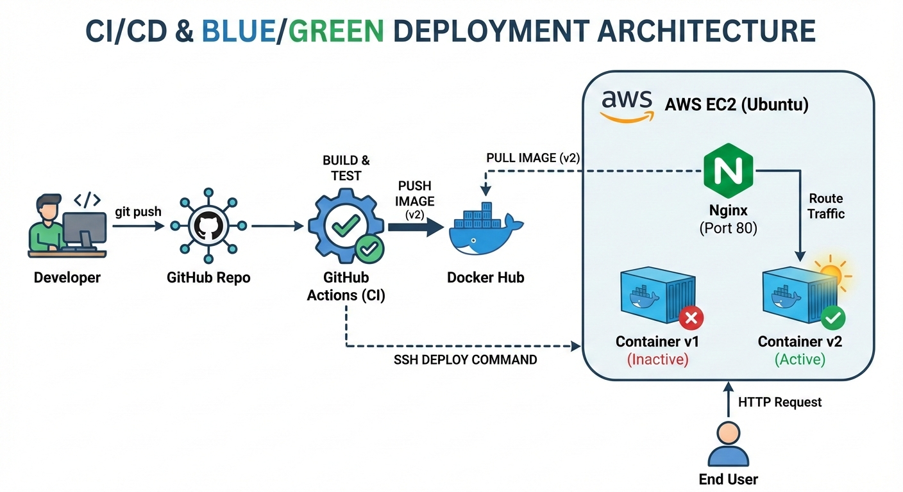

# Production-Ready CI/CD Pipeline

## Project Goal
Build a production-ready CI/CD pipeline for a containerized web service.

## Tech Stack
- Ubuntu Linux
- Git & GitHub
- Docker & Docker Hub
- GitHub Actions
- Nginx
- Bash

## 10-Day Plan
- Day 1: Linux setup, Git, Docker
- Day 2: Application development
- Day 3: Dockerization
- Day 4: Debugging Docker
- Day 5: Docker Hub & versioning
- Day 6: CI pipeline
- Day 7: CI failure handling
- Day 8: Server deployment
- Day 9: Reverse proxy & rollback
- Day 10: Documentation & defense

## Day 1 Notes
- Created non-root user
- Installed Git and Docker
- Configured Docker without root

## Day 2 Notes
- Built a minimal Node.js Express app
- Configured using environment variables without env file 
- Added health endpoint for monitoring

## Day 3 Notes
- Created production-optimized Dockerfile
- Used Alpine base image
- Excluded unnecessary files with .dockerignore
- Verified container restart behavior

## Day 4 – Docker Debugging

### Issue Introduced
- Modified Docker CMD to reference a non-existent file

### Observed Behavior
- Container exited immediately after startup

### Root Cause
- Node.js failed at runtime because the specified entry file was missing

### Resolution
- Corrected CMD to point to the valid server.js file
- Rebuilt image and redeployed container

### Lesson Learned
- Container startup failures often indicate runtime misconfiguration rather than build errors

## Day 5 – Docker Hub & Versioning

- Published Docker image to Docker Hub
- Used semantic versioning for image tags
- Maintained stable `latest` tag
- Verified image by pulling and running from registry

## Day 6 - CI Pipeline Established 
- Pipeline created
- Error identified 
- Run with debug build 
- Debug check without exposing secrets 

## Day 7 – CI Failure Handling

### Failure Introduced
- Injected a JavaScript syntax error in server.js

### CI Behavior
- Lint stage failed
- Pipeline stopped before Docker build

### Root Cause
- Node.js detected invalid syntax during linting

### Resolution
- Fixed syntax error
- Re-triggered pipeline successfully

## Day 8 – AWS EC2 Deployment

- Provisioned Ubuntu EC2 instance (t3.micro)
- Installed Docker and Nginx
- Pulled Docker image from Docker Hub
- Deployed container on AWS EC2
- Verified application accessibility via public IP

## Day 9 – Reverse Proxy & Rollback

- Configured Nginx as a reverse proxy
- Routed traffic through port 80
- Ran multiple app versions in parallel
- Switched traffic without downtime
- Performed instant rollback via Nginx reload

## Day 10 -Documentation
-  Architecture Diagram

- Deployment Process
The application is deployed on an AWS EC2 Ubuntu instance.
Docker is installed on the server and images are pulled from Docker Hub.
Nginx acts as a reverse proxy, exposing the application via port 80 while routing traffic to containers running on internal ports.

- Rollback Strategy
Multiple application versions run simultaneously on different ports.
Nginx routing is updated to switch traffic between versions without restarting containers.
Rollback is performed instantly by redirecting traffic back to the previous stable version.

